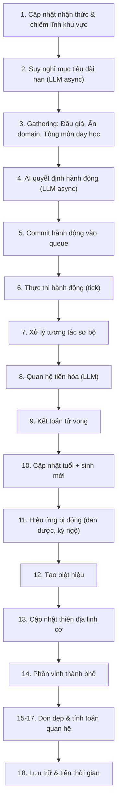
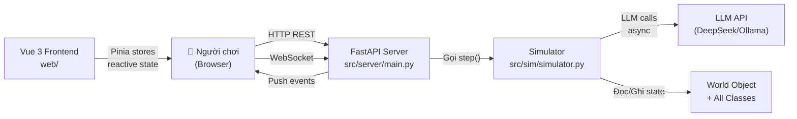

# 🌏 Tổng Quan Source Code: Cultivation World Simulator

## 📖 Giới thiệu dự án

**Cultivation World Simulator** là một trò chơi mô phỏng thế giới tu tiên (Xianxia) mã nguồn mở, được điều khiển hoàn toàn bởi AI/LLM. Người chơi không điều khiển nhân vật mà đóng vai **Thiên Đạo (God)** quan sát và tác động vào thế giới.

| Mục            | Chi tiết                              |
| -------------- | ------------------------------------- |
| **License**    | CC BY-NC-SA 4.0                       |
| **Backend**    | Python 3.10+ + FastAPI                |
| **Frontend**   | Vue 3 + TypeScript + Vite + PixiJS    |
| **AI Engine**  | LLM (DeepSeek, Ollama, v.v.)          |
| **Triển khai** | Docker / Source Code / Standalone EXE |

---

## 🗺️ Cấu Trúc Thư Mục Gốc

```
cultivation-world-simulator/
├── src/            # Backend Python (engine mô phỏng + API server)
├── web/            # Frontend Vue 3 (giao diện người dùng)
├── static/         # File tĩnh: config, ảnh, nhạc, data dữ liệu
├── tests/          # 74 file test (pytest)
├── docs/           # Tài liệu: frontend, i18n, sound, testing, spec
├── tools/          # Script tiện ích phát triển
├── deploy/         # Cấu hình triển khai Docker/Nginx
├── assets/         # Ảnh dùng trong README
├── docker-compose.yml
├── requirements.txt
└── pyproject.toml
```

---

## 🐍 Backend Python (`src/`)

### Cấu trúc `src/`

```
src/
├── sim/            # Vòng lặp mô phỏng chính (Simulator)
├── classes/        # Tất cả các class domain (Avatar, Sect, World...)
├── systems/        # Hệ thống game cốt lõi (cultivation, battle, fortune...)
├── server/         # FastAPI server + WebSocket API
├── utils/          # Tiện ích: LLM client, config, tên ngẫu nhiên...
├── run/            # Logger, runner
└── i18n/           # Hệ thống đa ngôn ngữ backend
```

---

### 🔄 Vòng Lặp Mô Phỏng: `src/sim/simulator.py`

Đây là **trái tim của game** — class `Simulator` điều phối toàn bộ tiến trình theo từng **tháng** (time step).

Mỗi lần gọi `step()` thực hiện **18 phase** theo thứ tự:



---

### 🧩 Classes Domain: `src/classes/`

#### Core Objects

| Thư mục/File        | Mô tả                                                                                                                   |
| ------------------- | ----------------------------------------------------------------------------------------------------------------------- |
| `core/avatar/`      | **Avatar (nhân vật)** — class chính gồm `core.py` (~20KB), `action_mixin.py`, `inventory_mixin.py`, `info_presenter.py` |
| `core/world.py`     | **World** — toàn bộ state thế giới (bản đồ, thời gian, các manager)                                                     |
| `core/sect.py`      | **Sect (Tông môn)** — thành viên, kỹ thuật, cấp bậc, phong cách                                                         |
| `core/orthodoxy.py` | **Orthodoxy** — chính tà phân loại                                                                                      |

#### Character Attributes

| File               | Mô tả                              |
| ------------------ | ---------------------------------- |
| `age.py`           | Tuổi tác & tuổi thọ theo cảnh giới |
| `hp.py`            | Hệ thống HP (máu)                  |
| `circulation.py`   | Tuần hoàn linh khí (tu luyện)      |
| `essence.py`       | Tinh – Khí – Thần                  |
| `persona.py`       | Tính cách nhân vật                 |
| `alignment.py`     | Chính – Tà – Trung lập             |
| `appearance.py`    | Ngoại hình                         |
| `spirit_animal.py` | Linh thú/Spirit Animal             |

#### Game Mechanics

| File                            | Mô tả                                               |
| ------------------------------- | --------------------------------------------------- |
| `technique.py`                  | Công pháp / Kỹ thuật tu luyện                       |
| `historia.py` → `history.py`    | Lịch sử nhân vật / Long-term memory                 |
| `event.py` + `event_storage.py` | Sự kiện & lưu trữ sự kiện                           |
| `long_term_objective.py`        | Mục tiêu dài hạn của nhân vật (LLM-driven)          |
| `nickname.py`                   | Hệ thống biệt hiệu (LLM-generated)                  |
| `single_choice.py`              | Quyết định 1 lần (chuyển công pháp, v.v.)           |
| `story_teller.py`               | Tạo vi kịch bản câu chuyện (micro-theater)          |
| `relation/`                     | Hệ thống quan hệ giữa các nhân vật                  |
| `mutual_action/`                | Hành động song phương (song tu, giao đấu...)        |
| `gathering/`                    | Sự kiện tập hợp nhiều người (đấu giá, ẩn domain...) |
| `effect/`                       | Buff/Debuff system                                  |
| `items/`                        | Đồ vật: đan dược, vũ khí, pháp bảo                  |
| `environment/`                  | Khu vực bản đồ (CultivateRegion, CityRegion, v.v.)  |
| `animal.py` + `material.py`     | Sinh thái: thú vật + nguyên liệu                    |
| `prices.py`                     | Hệ thống giá cả kinh tế                             |
| `celestial_phenomenon.py`       | Thiên địa linh cơ (hiện tượng thiên nhiên)          |

---

### ⚔️ Action System: `src/classes/action/`

37 file, mỗi file là một **hành động cụ thể** nhân vật có thể thực hiện:

```carousel
**Di chuyển**
- `move.py` — di chuyển cơ bản
- `move_to_avatar.py` / `move_away_from_avatar.py`
- `move_to_region.py` / `move_away_from_region.py`
- `move_to_direction.py`

<!-- slide -->
**Tu luyện & Chiến đấu**
- `respire.py` — hấp thụ linh khí
- `meditate.py` — thiền định
- `breakthrough.py` — đột phá cảnh giới
- `retreat.py` — bế quan
- `attack.py` — tấn công
- `assassinate.py` — ám sát
- `escape.py` — bỏ chạy
- `self_heal.py` — tự chữa thương
- `cast.py` — thi triển công pháp

<!-- slide -->
**Kinh tế & Xã hội**
- `buy.py` / `sell.py` — mua bán
- `educate.py` — giảng dạy
- `refine.py` — luyện đan
- `nurture_weapon.py` — rèn vũ khí
- `catch.py` — bắt thú
- `hunt.py` — săn bắt
- `harvest.py` / `mine.py` / `gather.py` — thu hoạch
- `temper.py` — tôi luyện thể xác
- `play.py` — thư giãn
- `help_people.py` / `devour_people.py` / `plunder_people.py` — tương tác với thường dân
```

**Cơ chế Action:**

- `action.py` — Base class Action
- `registry.py` — Đăng ký tất cả actions
- `action_runtime.py` — Runtime thực thi
- `cooldown.py` — Hệ thống cooldown
- `targeting_mixin.py` — Logic chọn mục tiêu

---

### 🏛️ Core Systems: `src/systems/`

| File                     | Mô tả                                                                        |
| ------------------------ | ---------------------------------------------------------------------------- |
| `cultivation.py` (~12KB) | **Hệ thống tu luyện**: Cảnh giới (Realm), đột phá, tính toán tiến độ         |
| `battle.py` (~12KB)      | **Hệ thống chiến đấu**: Ước tính tỉ lệ thắng, phong cách chiến đấu, khắc chế |
| `fortune.py` (~25KB)     | **Kỳ ngộ & Tai kiếp**: Trigger ngẫu nhiên các sự kiện đặc biệt               |
| `tribulation.py`         | **Thiên kiếp**: Thử thách khi đột phá cảnh giới cao                          |
| `time.py`                | **Hệ thống thời gian**: Month, Year, MonthStamp                              |

---

### 🤖 AI Layer: `src/classes/ai.py` + `src/utils/llm/`

- **`ai.py`** — Module trung tâm kết nối LLM với game logic. `llm_ai.decide()` nhận danh sách Avatar cần ra quyết định và trả về action plans.
- **`src/utils/llm/`** — Client wrapper cho LLM: hỗ trợ nhiều model (DeepSeek, Ollama, OpenAI-compatible APIs), async calls, retry logic.
- Mỗi NPC độc lập ra quyết định dựa trên: bộ nhớ ngắn/dài hạn, quan hệ xã hội, mục tiêu cá nhân, trạng thái hiện tại.

---

### 🌐 API Server: `src/server/main.py` (~72KB)

FastAPI server khổng lồ xử lý toàn bộ communication giữa frontend và engine:

- **HTTP REST API**: Khởi tạo game, lưu/tải game, cấu hình
- **WebSocket**: Truyền real-time events, trạng thái simulation
- **Dev mode**: `python src/server/main.py --dev` tự động khởi động cả backend lẫn Vite dev server

---

### 🌍 Đa Ngôn Ngữ: `src/i18n/`

- Hỗ trợ Tiếng Trung + Tiếng Anh (backend template strings)
- `t("key", **kwargs)` — hàm dịch với format string
- Tương đương với `vue-i18n` bên frontend

---

## 🖥️ Frontend Vue 3 (`web/`)

### Stack công nghệ

| Thư viện          | Vai trò                                |
| ----------------- | -------------------------------------- |
| **Vue 3**         | Framework UI                           |
| **TypeScript**    | Type safety                            |
| **Vite**          | Build tool + Dev server                |
| **Pinia**         | State management                       |
| **PixiJS v8**     | Render bản đồ 2D (canvas/WebGL)        |
| **pixi-viewport** | Camera/zoom cho bản đồ PixiJS          |
| **vue3-pixi**     | Tích hợp PixiJS vào Vue                |
| **Naive UI**      | Component library (panels, dialogs...) |
| **vue-i18n**      | Đa ngôn ngữ frontend                   |
| **VueUse**        | Composables tiện ích                   |
| **Vitest + MSW**  | Testing + API mocking                  |

---

### Cấu trúc `web/src/`

```
web/src/
├── App.vue             # Root component
├── main.ts             # Entry point, khởi tạo plugins
├── components/
│   ├── game/           # 24 component game chính
│   ├── layout/         # Layout wrappers
│   ├── LoadingOverlay.vue
│   ├── SplashLayer.vue # Màn hình giới thiệu
│   └── SystemMenu.vue  # Menu hệ thống (save/load/settings)
├── stores/             # 8 Pinia stores
├── api/                # HTTP + WebSocket client modules
├── composables/        # Vue Composables tái sử dụng
├── locales/            # File dịch i18n (zh/en)
├── types/              # TypeScript type definitions
├── utils/              # Tiện ích frontend
├── constants/          # Hằng số
├── directives/         # Vue directives tùy chỉnh
└── __tests__/          # 22 file test frontend
```

---

### 🗄️ Pinia Stores (`web/src/stores/`)

| Store        | Mô tả                                                    |
| ------------ | -------------------------------------------------------- |
| `world.ts`   | Toàn bộ state world: nhân vật, thời gian, thiên tượng... |
| `avatar.ts`  | Nhân vật đang được focus/xem chi tiết                    |
| `event.ts`   | Feed sự kiện game (lịch sử)                              |
| `map.ts`     | Trạng thái bản đồ (viewport, selected tile)              |
| `setting.ts` | Cài đặt người dùng (LLM config, tốc độ sim)              |
| `socket.ts`  | Trạng thái WebSocket connection                          |
| `system.ts`  | Trạng thái hệ thống (loading, errors)                    |
| `ui.ts`      | UI state (panels đang mở, modal...)                      |

---

### 📡 API Layer (`web/src/api/`)

- `http.ts` — Axios wrapper cho REST calls
- `socket.ts` — WebSocket client (nhận events real-time)
- `modules/` — Chia nhỏ API theo domain (avatar, world, settings...)

---

## 🧪 Testing (`tests/`)

**74 file test** với pytest, coverage toàn diện:

```carousel
**Unit Tests**
- `test_battle.py` — Logic chiến đấu
- `test_cultivation_logic.py` — Logic tu luyện
- `test_circulation.py` — Tuần hoàn linh khí
- `test_elixir.py` — Đan dược
- `test_relations_logic.py` — Quan hệ nhân vật
- `test_breakthrough_logic.py` — Đột phá cảnh giới

<!-- slide -->
**Integration Tests**
- `test_game_init_integration.py` (~38KB, test lớn nhất) — Khởi tạo game end-to-end
- `test_ai.py` (~25KB) — AI decision making với LLM mock
- `test_mutual_actions.py` (~25KB) — Hành động song phương

<!-- slide -->
**API Tests**
- `test_api_events.py` — REST API events
- `test_websocket_handlers.py` — WebSocket handlers
- `test_server_binding.py` — Server binding
- `test_init_status_api.py` — Status API
- `test_save_load_events.py` — Save/Load system

<!-- slide -->
**Action Tests**
- `test_action_combat.py` — Combat actions
- `test_action_craft.py` — Crafting actions
- `test_action_social.py` — Social actions
- `test_action_move.py` — Movement
- `test_auction.py` — Đấu giá
- `test_hidden_domain.py` — Ẩn domain exploration
```

---

## 🔁 Luồng Dữ Liệu Tổng Thể



---

## 📦 Static Files (`static/`)

- `local_config.yml` — File cấu hình chính: LLM API key, host, cảnh giới thế giới, tốc độ sim
- Data CSV: tên, kỹ thuật, trang bị, khu vực...
- Assets âm nhạc (BGM)
- Thế giới mặc định được sinh ra khi khởi tạo game

---

## 🛠️ Tools (`tools/`)

Script hỗ trợ phát triển:

- Tạo data (tên, kỹ thuật, map)
- Convert assets
- Dev utilities

---

## 🚀 Cách Chạy

```bash
# Cách 1: Docker (khuyên dùng)
docker-compose up -d --build
# Frontend: http://localhost:8123 | Backend: http://localhost:8002

# Cách 2: Source code (dev)
pip install -r requirements.txt
cd web && npm install && cd ..
python src/server/main.py --dev
```

Sau khi chạy, vào **trang Settings** trên trình duyệt để cấu hình LLM provider (DeepSeek, Ollama...).
